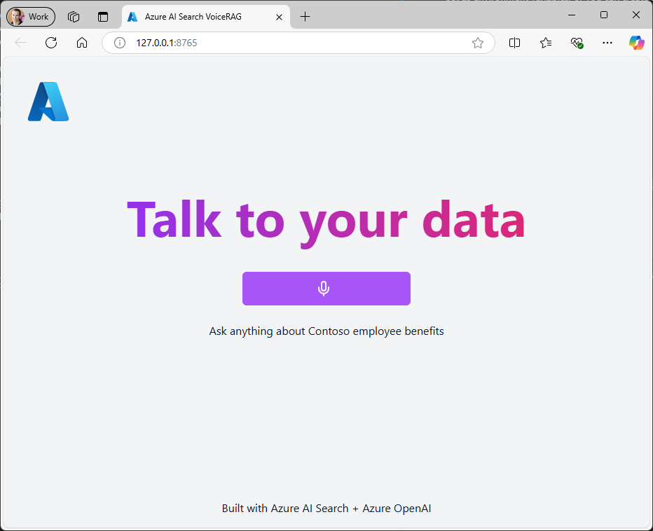

# VoiceFlow: An Application Pattern for RAG + Promptflow using the GPT-4o Realtime API for Audio

[Video Demonstration](https://youtu.be/oGP_WgxqYJM)

This repo contains a fork of the [VoiceRAG](https://aka.ms/voicerag) example of how to implement RAG support in applications that use voice as their user interface, powered by the GPT-4o realtime API for audio.  This example leverages [Semantic Kernel](https://aka.ms/semantickernel) [Promptflow](https://aka.ms/promptflow) to perform Agentic tool execution such as Web retrieval and simple Analysis steps when interacting with the gpt-4o-realtime voice model. 

## Running this sample
We'll follow 4 steps to get this example running in your own environment: pre-requisites, creating an index, setting up the environment, and running the app.

### 1. Pre-requisites
You'll need instances of the following Azure services. You can re-use service instances you have already or create new ones.
1. [Azure OpenAI](https://ms.portal.azure.com/#create/Microsoft.CognitiveServicesOpenAI), with 2 model deployments, one of the **gpt-4o-realtime-preview** model, and one for embeddings (e.g.text-embedding-3-large, text-embedding-3-small, or text-embedding-ada-002)
3. [Promptflow](https://aka.ms/promptflow) to help you create prompts for the GPT-4o model

### 2. Connecting Promptflow

## Create connection for LLM tool to use
You can follow these steps to create a connection required by a LLM tool.

Currently, there are connection types required by the promptflow tool: "AzureOpenAI" and "BingConnection". 

From the path /voice_app/app_backend/semantic_kernel_autogen_planner, update the values in each yaml file and create the Promptflow connection strings

```bash
# Create azure open ai connection
# pf connection create --file default_azureopenai.yaml --set api_key=<your_api_key> api_base=<your_api_base> --name open_ai_connection
```

```bash
# Create azure open ai connection
# pf connection create --file bing_connection.yaml --set api_key=<your_api_key> api_base=<your_api_base> --name open_ai_connection
```

### 3. Setting up the app environment
The app needs to know which service endpoints to use for the Azure OpenAI and Azure AI Search. The following variables can be set as environment variables, or you can create a ".env" file in the "app/backend/" directory with this content.
   ```
   AZURE_OPENAI_ENDPOINT=wss://<your instance name>.openai.azure.com
   AZURE_OPENAI_DEPLOYMENT=gpt-4o-realtime-preview
   AZURE_OPENAI_API_KEY=<your api key>
   ```
   To use Entra ID (your user when running locally, managed identity when deployed) simply don't set the keys. 

### 4. Running the app

#### GitHub Codespaces (experimental YMMV)
You can run this repo virtually by using GitHub Codespaces, which will open a web-based VS Code in your browser:

[](https://github.com/codespaces/new?hide_repo_select=true&ref=main&skip_quickstart=true&machine=basicLinux32gb&repo=860141324&devcontainer_path=.devcontainer%2Fdevcontainer.json&geo=WestUs2)

Once the codespace opens (this may take several minutes), open a new terminal.

#### VS Code Dev Containers (experimental YMMV)
You can run the project in your local VS Code Dev Container using the [Dev Containers extension](https://marketplace.visualstudio.com/items?itemName=ms-vscode-remote.remote-containers):

1. Start Docker Desktop (install it if not already installed)
2. Open the project:

    [](https://vscode.dev/redirect?url=vscode://ms-vscode-remote.remote-containers/cloneInVolume?url=https://github.com/azure-samples/aisearch-openai-rag-audio)
3. In the VS Code window that opens, once the project files show up (this may take several minutes), open a new terminal.

#### Local environment
1. Install the required tools:
   - [Node.js](https://nodejs.org/en)
   - [Python >=3.11](https://www.python.org/downloads/)
      - **Important**: Python and the pip package manager must be in the path in Windows for the setup scripts to work.
      - **Important**: Ensure you can run `python --version` from console. On Ubuntu, you might need to run `sudo apt install python-is-python3` to link `python` to `python3`.
   - [Powershell](https://learn.microsoft.com/powershell/scripting/install/installing-powershell)

2. Clone the repo (`git clone https://github.com/Azure-Samples/aisearch-openai-rag-audio`)
3. Create a Python virtual environment and activate it.
4. The app needs to know which service endpoints to use for the Azure OpenAI and Azure AI Search. The following variables can be set as environment variables, or you can create a ".env" file in the "app/backend/" directory with this content.
   ```
   AZURE_OPENAI_ENDPOINT=wss://<your instance name>.openai.azure.com
   AZURE_OPENAI_DEPLOYMENT=gpt-4o-realtime-preview
   AZURE_OPENAI_API_KEY=<your api key>
   ```
   To use Entra ID (your user when running locally, managed identity when deployed) simply don't set the keys.  
5. Run this command to start the app:

   Windows:

   ```pwsh
   cd app
   pwsh .\start.ps1
   ```

   Linux/Mac:

   ```bash
   cd app
   ./start.sh
   ```

6. The app is available on http://localhost:8765

Once the app is running, when you navigate to the URL above you should see the start screen of the app:


### Notes
